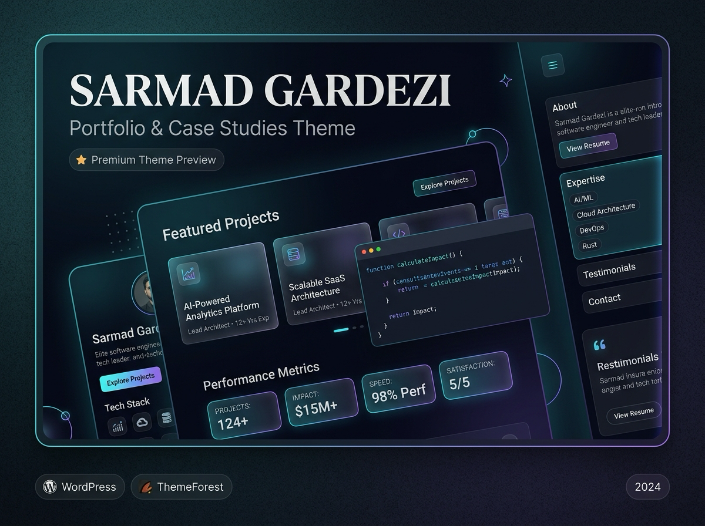

<div align="center">

# ⚡ Sarmad Gardezi — WordPress Theme

**A bespoke, high-performance WordPress theme engineered for personal branding, engineering portfolios, architectural case studies, and technical writing.**

<p align="center">
  <a href="https://sarmadgardezi.com"><strong>Explore Live Site »</strong></a>
  •
  <a href="#-theme-preview">View Preview</a>
  •
  <a href="#-architecture">Architecture</a>
  •
  <a href="#-connect--socials">Connect</a>
</p>

<!-- Badges -->
<p align="center">
  
  
  
  
  
</p>

<!-- Social Badges -->
<p align="center">
  <a href="https://github.com/sarmadgardezi">
    
  </a>
  <a href="https://linkedin.com/in/sarmadgardezi">
    
  </a>
  <a href="https://twitter.com/sarmadgardezi">
    
  </a>
  <a href="https://sarmadgardezi.com">
    
  </a>
  <a href="mailto:contact@sarmadgardezi.com">
    
  </a>
</p>

</div>

---

## 📸 Theme Preview

<div align="center">
  
</div>

---

## ✨ Key Highlights

- 🏎️ **Optimized for Extreme Performance**: Built with zero reliance on bulky page builders or jQuery. Clean, modern semantic HTML5 and vanilla JavaScript yield 95+ PageSpeed & Core Web Vitals scores.
- 🎨 **Luxury Dark Aesthetic**: Designed with obsidian dark surfaces (`#07090e`), subtle glassmorphism backdrops, and vibrant electric cyan (`#00f0ff`) and indigo (`#6366f1`) accents.
- 📐 **Modular Sass 7-1 Architecture**: SCSS source code structured across `abstracts`, `base`, `components`, `layout`, and `pages` for maintainability, compiling directly into an optimized `main.min.css`.
- 🧩 **Componentized Front-End**: Modular template parts for every section (`hero`, `about`, `expertise`, `featured-projects`, `case-studies`, `latest-posts`, `community`, `contact-cta`).
- 📱 **Mobile First & Fully Accessible**: Keyboard accessible navigation, smooth mobile drawer menu, screen-reader utilities, and responsive breakpoints.
- ⚙️ **Modern WordPress Standards**: Comprehensive `theme.json` integration, custom logo support, post thumbnails, and clean theme separation via `inc/` modules.

---

## 📁 Architecture & Structure

The theme is organized into clean, single-responsibility modules:

```text
sarmadgardezi/
├── style.css                         # Required WP theme header & metadata
├── functions.php                     # Theme bootstrap only (loads inc/)
├── theme.json                        # Global block & editor styles/tokens
├── index.php                         # Required fallback template
├── header.php / footer.php           # Clean HTML5 wrappers
├── front-page.php                    # Dynamic homepage section orchestrator
├── screenshot.png                    # Official WP Appearance preview
│
├── template-parts/
│   ├── global/                       # Site header, footer, social links
│   ├── home/                         # Modular homepage sections
│   └── blog/                         # Post cards and article wrappers
│
├── inc/
│   ├── setup.php                     # Theme supports, menus, thumbnail sizes
│   ├── enqueue.php                   # Typography, stylesheets & scripts
│   └── helpers.php                   # SVG icons, reading time & utilities
│
└── assets/
    ├── scss/                         # Sass 7-1 architecture (abstracts, base, etc.)
    ├── css/main.min.css              # Generated production stylesheet
    ├── js/                           # Navigation, animations & core logic
    └── images/                       # Branded SVG vectors & assets
```

> For the comprehensive file breakdown, read the detailed **[THEME_STRUCTURE.md](sarmadgardezi/THEME_STRUCTURE.md)**.

---

## 🚀 Getting Started

### 1. Clone or Download

Clone this repository into your WordPress installation's `themes` directory:

```bash
cd wp-content/themes/
git clone https://github.com/sarmadgardezi/sarmadgardeziwp.git
```

### 2. Activate Theme

1. Log into your WordPress admin dashboard (`/wp-admin`).
2. Navigate to **Appearance** → **Themes**.
3. Locate **Sarmad Gardezi** and click **Activate**.

### 3. Recommended Initial Settings

- **Homepage Settings**: Go to **Settings** → **Reading**, select **A static page**, and set your homepage to your Front Page.
- **Navigation Menus**: Go to **Appearance** → **Menus** and create your Primary and Footer menus.
- **Permalinks**: Ensure permalinks are set to **Post name** under **Settings** → **Permalinks**.

---

## 🛠️ Tech Stack

| Layer | Technology |
| :--- | :--- |
| **Platform** | WordPress 6.2+ / PHP 8.0+ |
| **Typography** | Plus Jakarta Sans & JetBrains Mono |
| **Styling** | Sass (7-1 Architecture) & Vanilla CSS Variables |
| **Scripting** | Modern ESNext / Vanilla JavaScript |
| **Theme Engine** | Classic PHP + Modern `theme.json` Hybrid |
| **Icons** | Custom Inline Accessible SVGs |

---

## 📬 Connect & Socials

I'm always open to discussing technical architecture, enterprise software engineering, open-source projects, and high-impact digital ventures.

<div align="center">

[](https://sarmadgardezi.com)
&nbsp;
[](https://linkedin.com/in/sarmadgardezi)
&nbsp;
[](https://github.com/sarmadgardezi)
&nbsp;
[](https://twitter.com/sarmadgardezi)
&nbsp;
[](mailto:contact@sarmadgardezi.com)

</div>

---

## 📄 License

This theme is licensed under the [GNU General Public License v2.0 or later](http://www.gnu.org/licenses/gpl-2.0.html).

<div align="center">
  <sub>Engineered with precision & clean code by <a href="https://sarmadgardezi.com"><strong>Sarmad Gardezi</strong></a>.</sub>
</div>
